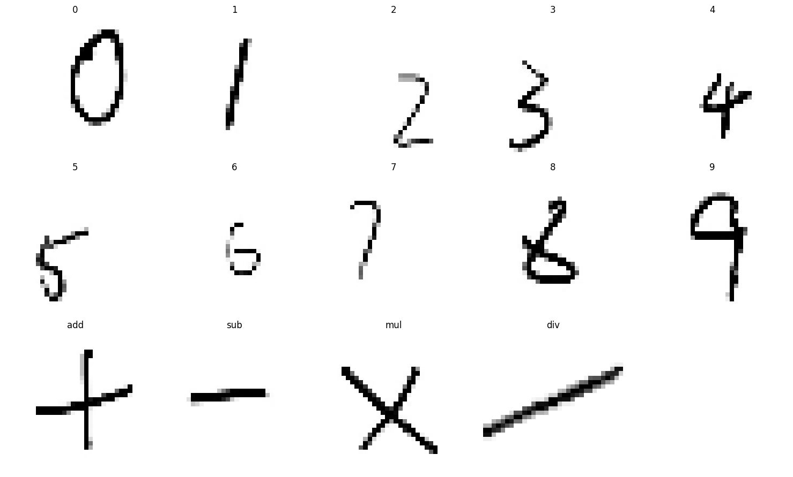
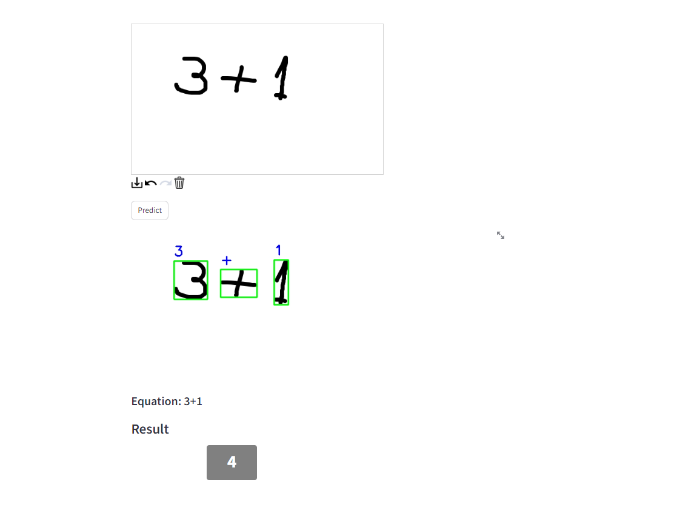
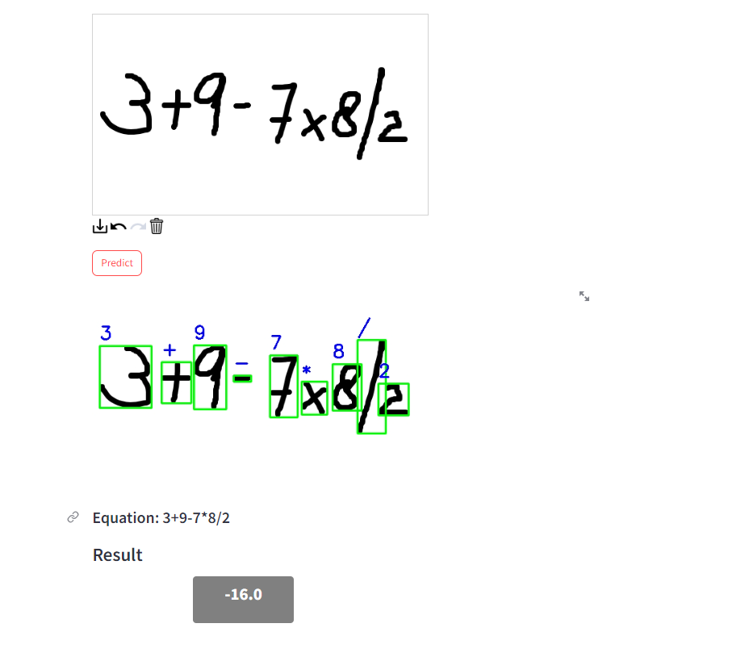

# Equation_solver model based on cnn
This folder contains images used in the Jupyter notebooks for visualizations and analysis related to handwritten equation solver and streamlit application.
Math characters recognized using CNN 👇🏻

